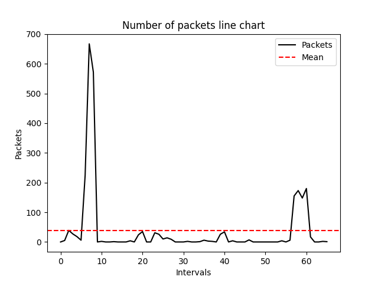
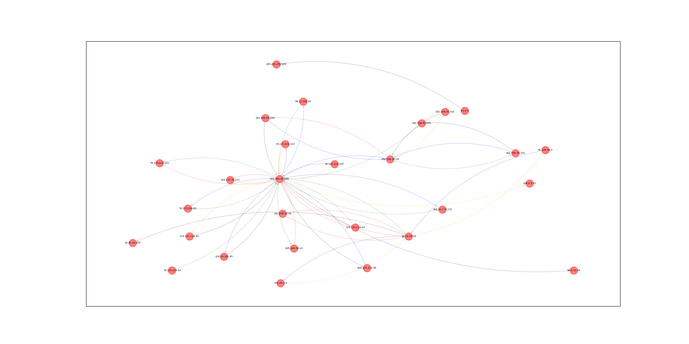

# PCAP / Network Analysis Tool (Python)

A menu-driven terminal tool for analysing `.pcap` captures.  
It parses packets, builds tabular summaries, computes simple statistics, and generates visualisations (line chart & communication graph).

---

## Features

- **Open & parse PCAP** (Ethernet/IP) and cache key fields per packet for fast queries.
- **Interactive menu with 7 options** to explore the capture using the information stored on load. (Menu invoked after the file check.)
- **Packet table output** (pretty-printed) using `tabulate`.
- **Statistics**: calculates a mean/average of packets per interval. (Used in the line-chart overlay.)  
- **Visualisations**:
  - **Line chart**: number of packets per interval with mean baseline (Matplotlib).  
    
  - **Network graph**: IP-to-IP communication graph (NetworkX).  
    
- **Dependency map**: module-level diagram of call flow.  
  

> Core libraries used: `dpkt`, `socket`, `tabulate`, `networkx`, `matplotlib`.

---

## Project structure

```bash
pcap-network-analyser/
├── pcap_analyser.py      # Entry point / CLI
├── packet_analysis.py    # Menu & analysis orchestration
├── packet_table.py       # Tabular summaries (tabulate)
├── plot_graph.py         # Matplotlib line chart & NetworkX graph
├── request.py            # Input helpers (e.g., file path prompts)
├── evidence/
│   ├── dependency_diagram.jpeg
│   ├── evidence-packet-analysis_line_chart.png
│   ├── evidence-packet-analysis_net_graph.png
│   └── pep8-pylint-compliant-evidence.pdf
└── README.md
```

---

The dependency diagram shows `packet_analysis.main` invoking a `menu`, which in turn calls:
- `packet_table.create_packet_table`
- `packet_table.calculate_packet_mean`
- `plot_graph.create_network_graph`
- `plot_graph.create_line_chart`
- plus helpers like `ip_address_pairs` and request utilities. *(See diagram)*

---

## Installation

Python **3.8+** recommended.

```bash
# (optional) create a venv
python3 -m venv .venv
source .venv/bin/activate  # Windows: .venv\Scripts\activate

# install libs
pip install dpkt tabulate networkx matplotlib
```
